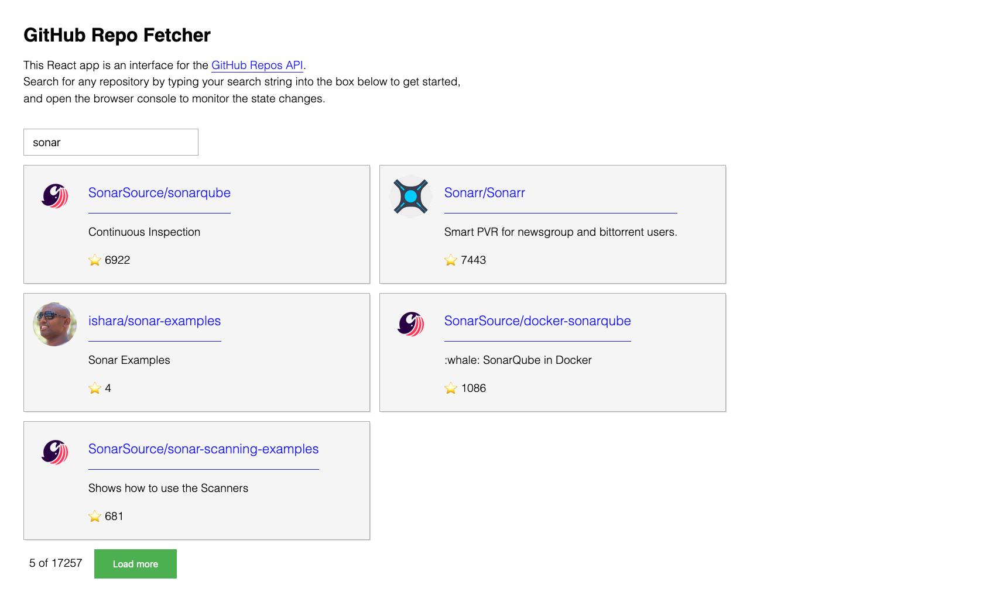

I recently built a React app that fetches data from the [GitHub Repos API](https://docs.github.com/en/rest/repos), [which you can check-out on GitHub pages](https://xari.github.io/github-repo-fetch/).
This was for an interview challenge, and the most interesting part of the challenge to me was how to properly manage application state using only React.
The code for this project can be found on my GitHub [here](https://github.com/xari/sonar-interview-react-app), and you can see a screenshot of it below.



Keep in mind, this UI must let the user do the following:

- Search for GitHub repositories using _only_ a text input.
- Load more repositories (because the repos API paginates the results)

Additionally, the UI must also provide meaningful feedback to the user.

- _"Loading..."_ text when a search has been initiated, as well as when the _"Load more"_ button has been clicked.
- _"No repositories matched that query."_, when no repositories are found that match the search string.

Finally, the pagination of the returned repositories must also be reflected.

- ex. _"5 of 17325"_
- ex. _"All 8 of 8 matching repositories shown."_

At first glance, I assumed that this required state variables for the following:

- Search/query string (ex. `""`)
- The fetched repositories (ex. `[]`)
- The pagination data (ex. `1`), which is needed to fetch additional repos from the paginated API
- The loading state (ex. `true`)

Four state variables may not seem like a whole lot, but in my experience every new state variable exponentially increases the likelihood of conflicting state.
So, after some struggling-around and a few bugs later, I opted for a simplified approach which relies less on properly navigating React's component lifecycle, and relies more on simple functional programming -simplified by React's `useReducer()` hook.
The result is two state variables, `repos` and `loading`, whose behavior I outline below.

Here's how the UI works:

- User types a search string into the text input.
  - This triggers a fetch from the Repo API...
  - as well as the _"Loading..."_ text,
  - and ultimately the repositories are rendered, or if no repositories are returned, the _"No repositories matched..."_ text.
- If the user wants to fetch more repositories, they simply click the green _"Load more"_ button, and the above process is repeated.

If you haven't yet used the `useReducer()` React hook, it offers a controlled way of updating state.
In this case, I've created three _dispatches_ that control the way the `repo` state will be modified: _"fill"_, _"increment"_, and _"clear"_.
**Because I'm creating the `repos` state using `useReducer()` instead-of `useState()`, these dispatches are the only ways in which the application can modify the `repos` state.**

```js
function reduceRepos(state, { type, ...repos }) {
  switch (type) {
    case "fill": // Think: fresh fetch (page 1)
      return repos;
    case "increment": // Think: fetch next page of repo data
      return {
        ...state,
        items: [...state.items, ...repos.items],
        page: state.page + 1,
      };
    case "clear": // Clear the search field
      return {};
    default:
      throw new Error();
  }
}
```

A state reducer has access to the current `state`, as well as to whatever value is dispatched to the reducer.
In this case, I dispatch the `type` of the dispatch (`"fill"`, `"increment"`, `"clear"`), as well as the next page of fetched repositories.
For example, on an initial fetch of the repositories, I dispatch a "fill", and provide the dispatch with the newly-fetched repository data.

```js
fetchRepos(searchQuery) // Ex. "D3"
  .then((repos) => dispatchRepos({ type: "fill", ...repos }))
  .then(() => setLoading(false));
```

`fetchRepos()` is a function that I created to fetch the data from the Repos API.
It accounts for the paginated API, and it shapes the response into the structure that I use for rendering the repositories in my UI.

```js
function fetchRepos(q, page = 1) {
  return fetch(
    `https://api.github.com/search/repositories?q=${q}&per_page=5&page=${page}`
  )
    .then((response) => response.json())
    .then((newRepos) => {
      const repoItems = newRepos.items.map((item) => {
        return {
          id: item.id,
          full_name: item.full_name,
          avatar_url: item.owner.avatar_url,
          owner: item.owner.login,
          html_url: item.html_url,
          description: item.description && truncate(item.description),
          stargazers_count: item.stargazers_count,
        };
      });

      return {
        q, // Search string
        total_count: newRepos.total_count,
        items: repoItems,
        page,
      };
    });
}
```

Notice that `fetchRepos()` returns an object that contains all of the info that I originally thought I needed separate state values for.

- The search string itself.
- The number of all repositories that match the search string
- The repositories (`items`),
- and finally the `page` number, which keeps track of the pagination.

## Tying it all together

There's more to the app than what I've covered in this post, but when it comes to state, this the code below covers everything:

```js
function App() {
  const [loading, setLoading] = useState(false);
  const [repos, dispatchRepos] = useReducer(reduceRepos, {});

  const handleChange = async (e) => {
    const searchQuery = e.target.value;

    if (searchQuery === "") {
      dispatchRepos({ type: "clear" }); // User has cleared the input field
    } else {
      setLoading(true);

      fetchRepos(searchQuery)
        .then((repos) => dispatchRepos({ type: "fill", ...repos }))
        .then(() => setLoading(false));
    }
  };

  const handleClick = async () => {
    const { q, page } = repos;

    setLoading(true);

    fetchRepos(q, page + 1)
      .then(({ items }) => {
        dispatchRepos({ type: "increment", items });
      })
      .then(() => setLoading(false));
  };

  return (
    <>
      <input onChange={handleChange} placeholder="Search for repos here" />

      <button onClick={handleClick}>
        {loading ? "Loading..." : "Load more"}
      </button>
    </>
  );
}
```
